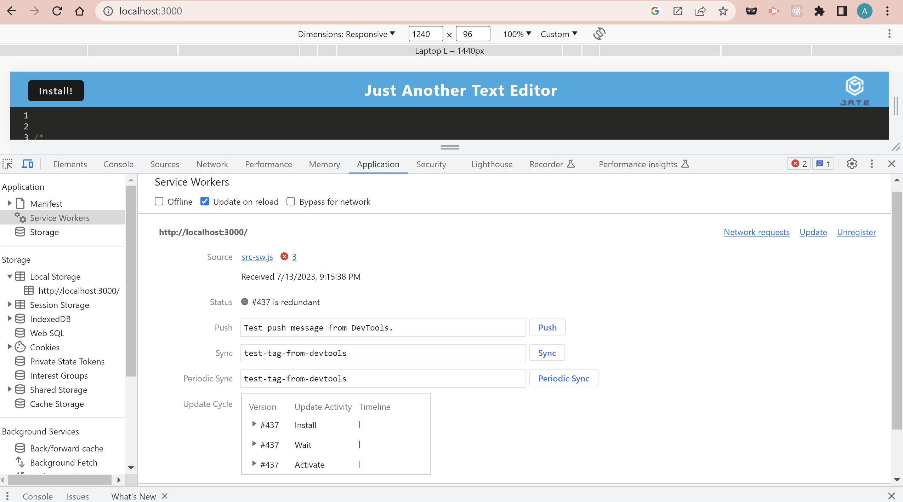

# PWA-Challenge
the deployed app link will be here:  https://jate-pwa-challenge-2de8fbdbf14e.herokuapp.com/

## Table of contents
- [User Story](#User-Story)
- [Accecptance Criteria](#Accecptance-Criteria)
- [Screenshots](#Screenshots)
- [Resources](#Resources)

## User Story
AS A developer
I WANT to create notes or code snippets with or without an internet connection
SO THAT I can reliably retrieve them for later use

## Accecptance Criteria
GIVEN a text editor web application
WHEN I open my application in my editor
THEN I should see a client server folder structure
WHEN I run `npm run start` from the root directory
THEN I find that my application should start up the backend and serve the client
WHEN I run the text editor application from my terminal
THEN I find that my JavaScript files have been bundled using webpack
WHEN I run my webpack plugins
THEN I find that I have a generated HTML file, service worker, and a manifest file
WHEN I use next-gen JavaScript in my application
THEN I find that the text editor still functions in the browser without errors
WHEN I open the text editor
THEN I find that IndexedDB has immediately created a database storage
WHEN I enter content and subsequently click off of the DOM window
THEN I find that the content in the text editor has been saved with IndexedDB
WHEN I reopen the text editor after closing it
THEN I find that the content in the text editor has been retrieved from our IndexedDB
WHEN I click on the Install button
THEN I download my web application as an icon on my desktop
WHEN I load my web application
THEN I should have a registered service worker using workbox
WHEN I register a service worker
THEN I should have my static assets pre cached upon loading along with subsequent pages and static assets
WHEN I deploy to Heroku
THEN I should have proper build scripts for a webpack application

## Screenshots
 - This first image shows some of the functionality of the app

 - This second image shows the manifest.JSON 

 - This image is of the service worker

 - This image is of the apps indexDB
 
 - This last image is a picture of the app photo on my desktop 
 

 ## Resources 

 For this app I was able to complete it with classmates and tutors. I was able to read and learn a lot about webpacks by creating this application !